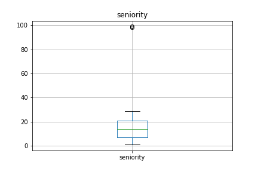

# Initial data validation

We have no missing values in our data. There are 13508 values for the quit date, which is a little more than 50% of total data. We have a fairly balanced dataset.

```
<class 'pandas.core.frame.DataFrame'>
Int64Index: 24700 entries, 0 to 24699
Data columns (total 9 columns):
employee_id    24700 non-null float64
company_id     24700 non-null int64
dept           24700 non-null int64
seniority      24700 non-null int64
salary         24700 non-null float64
join_date      24700 non-null datetime64[ns]
quit_date      13508 non-null datetime64[ns]
tenure         24700 non-null float64
quit           24700 non-null int64
dtypes: datetime64[ns](2), float64(3), int64(4)
memory usage: 1.9 MB
```

Diving deeper into the data, we see that there are two extreme outliers for seniority: 98 and 99.


```
count    24702.000000
mean        14.127803
std          8.089520
min          1.000000
25%          7.000000
50%         14.000000
75%         21.000000
max         99.000000
Name: seniority, dtype: float64
```



We should remove these as it is very unlikely that anyone would have over 60 years of work experience.

# Data Cleaning

First we keep only data for employees with fewer than 60 years of work experience.

```python
df = df[df.seniority < 60]
```

We need to label our response variable:

```python
df['quit'] = 0
df.loc[~df.quit_date.isnull(), 'quit'] = 1
```

One factor that matters a lot in employee retention is how long that person has been with that company. Here, we will create an additional column called `tenure` that calculates how long the employee has been with the company as of '2015-12-13' or when he/she quit, whichever is sooner.

```python
df['tenure'] = (df.quit_date - df.join_date).dt.days
mask = df.quit_date.isnull()
df.loc[mask, 'tenure'] = (datetime.strptime('2015-12-13','%Y-%m-%d') - (df[mask].join_date)).dt.days
```

For exploratory purposes, we also bin the tenure into different groups based on length. There are 10 bins of half-year intervals from 0 to 5 years.


```python
categories = pd.cut(df['tenure'], bins, labels=group_names)
df['tenure_bin'] = pd.cut(df['tenure'], bins, labels=group_names)
```

We also standardize the salary column by dividing by 10000

Our final dataframe looks something like this:

| index   |  employee_id |   company_id | dept | seniority | salary | join_date | quit_date  | quit       | tenure | tenure_bin |      
|-----------------------|--------------|------|-----------|--------|-----------|------------|------------|--------|------------|-----|
| 0                     | 36.0         | 4    | 1         | 29     | 22.6      | 2012-04-09 | 2014-06-20 | 1      | 802.0      | 2.0 |
| 1                     | 70.0         | 2    | 3         | 6      | 22.0      | 2013-01-07 | 2013-11-29 | 1      | 326.0      | 0.5 |
| 2                     | 107.0        | 4    | 3         | 15     | 23.7      | 2015-06-29 | NaT        | 0      | 167.0      | 0.0 |
| 3                     | 155.0        | 2    | 3         | 28     | 31.0      | 2015-11-02 | NaT        | 0      | 41.0       | 0.0 |
| 4                     | 157.0        | 2    | 0         | 12     | 7.5       | 2012-04-02 | NaT        | 0      | 1350.0     | 3.5 |


# Exploratory data analysis

Our first instinct would be to look at company and salary. While the majority of companies have 45 - 50% retention rate, company 10 only has 25% retention rate.

| index | company_id | salary | quit          |           
|------------|--------|---------------|----------|
| 0          | 1      | 152163.700648 | 0.544490 |
| 1          | 2      | 155728.090952 | 0.522501 |
| 2          | 3      | 122118.588578 | 0.556930 |
| 3          | 4      | 122721.144520 | 0.559166 |
| 4          | 5      | 123348.717949 | 0.560114 |
| 5          | 6      | 119925.639040 | 0.551510 |
| 6          | 7      | 121582.516340 | 0.565359 |
| 7          | 8      | 122284.622732 | 0.553009 |
| 8          | 9      | 123905.306972 | 0.550468 |
| 9          | 10     | 121386.574074 | 0.554398 |
| 10         | 11     | 109562.500000 | 0.750000 |
| 11         | 12     | 73000.000000  | 0.500000 |


However, the lowest salary company also has the highest retention rate.

Taking a closer looks shows that company 12 employs a lot of customer service representatives who are generally paid lower than other positions. This might explain why they still manage to retain 50% of the workforce despite the low average. This tells us that we need to take into consideration the interaction of `dept.`, `seniority` and `salary` to truly reflect the effect of financial incentives on retention.

We also know that people tend to move jobs after a certain number of years. Let's see what that looks like:


At interesting pattern emerges. The attrition rate tends to peak at the anniversary point (1,2,3,4 years in). Overall, however, longer-tenured employees tend to quit less.

# Modeling

At this point, we know that we want some deep interaction among dept., salary and company. In addition, we observed a non-linear pattern in tenure versus attrition.

Given these information, a tree-based model would be the best fit. The hierarchical nature of tree-based models would help us identify interaction among features. In addition, the non-linear pattern in tenure cannot be captured in a parametric model like logistics regression without some data transformation.

Let's fit a Gradient Boosting Classifier with 1000 trees and max_depth = 4 to allow for deeper interactions.

# Result

We get the following feature importance value:

```
# company, dept, seniority, salary, tenure
[ 0.01680282  0.00978414  0.02883855  0.06163189  0.88294261]
```

and partial dependence plot


Tenure dominates in the feature importance values. We also see that the partial dependence plot agrees with our observation earlier about attrition peaking on yearly anniversary.

Tenure can either be a causal variable or the result of a confounding variable. An explanation for the former could be that employees do not want to spend a long time at a company (even if there is nothing wrong with their current positions) and tend to make the move once they've reached a comfortable anniversary.

An explanation for the latter is that an employee could be unhappy and anniversaries are good times to move due to contractual issues like vesting of stock options, etc.

For the sake of being thorough, let's remove tenure to see how strong the other four variables are.

```
# company, dept, seniority, salary
[ 0.21283083  0.07566071  0.30864101  0.40286745]
```


We see that seniority and salary are now the most important features. In terms of salary, it's interesting to note that employees who make either very little money or a lot of money tend to be less mobile than those in the middle.

In terms of seniority, there isn't a strong pattern except that lower-level employees between level 3 and 6 tend to be a lot less mobile. However, seniority level could be different across companies so this is not likely something we want to heavily rely on.

# Conclusion

Given how dominant tenure is, we likely want more information to determine whether it is causal or the result of a confounding variable.

The best additional data would be post-transition seniority and salary. However, this is unlikely to be available in real life. The best estimate would how much above or below market employees were paid before they quit. If we see a pattern in average- or above-market employees staying but and below-market employees on the move, then we might conclude that tenure is likely the result of a confounding variable (e.g. below-market pay)

On the other hand, if we see a consistent pattern among all the employees regardless of pay percentile, we might conclude that tenure might actually be causal and that employees like to move around.
